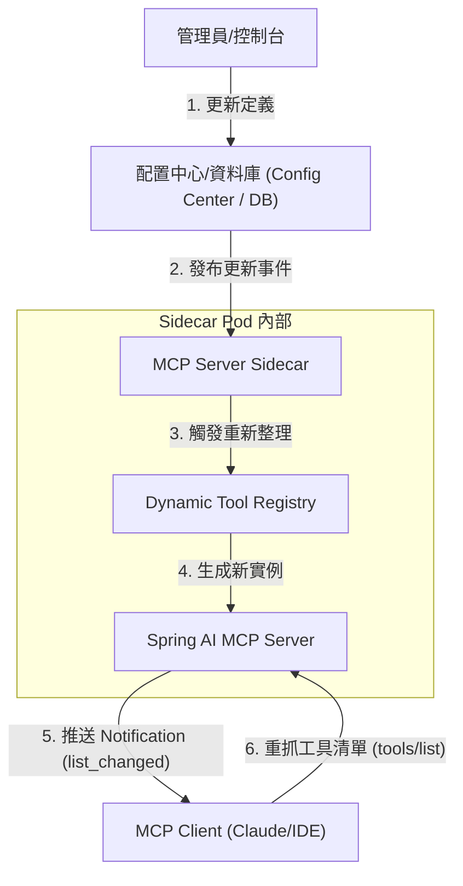

# MCP 遠端動態更新架構設計 (Remote Dynamic Update)

本文檔詳細說明了 MCP Server 如何實現工具定義的「熱更新 (Hot-Reloading)」，確保在不重啟服務的情況下動態調整 AI 的能力。

## 1. 核心架構 (Architecture Overview)

採用 **發佈-訂閱 (Pub-Sub)** 與 **MCP 協議通知** 機制，實現配置到 AI 客戶端的即時同步。

---

## 2. 核心互動流程 (Interaction Flow)

### 階段一：源頭變更 (Configuration Trigger)
管理員在管理後台（如 K8s 控制台、專屬運維界面）修改了某個工具的 **描述 (Description)** 或 **JSON Schema**。
*   **場景**：優化 LLM 對該工具的理解，或對接新的後端 API 版本。

### 階段二：熱載入 (Hot-Reloading)
Sidecar 偵測到配置變更，並在內存中完成「換裝」：
*   **觸發機制**：可透過 Webhook、ConfigMap 掛載監聽、或是資料庫定期掃描。
*   **實作**：利用 Spring AI 的 `ToolCallback` 抽象，動態替換注入到 `McpServer` 中的 Callback 實例。

### 階段三：協議同步 (Protocol Sync)
這是 MCP 協議的精華，確保連線中的 AI 客戶端能獲得同步：
*   **行為**：MCP Server 透過 SSE 通道，向所有連線中的客戶端發送 `notifications/tools/list_changed`。
*   **效用**：客戶端收到此訊號後，會自發性發起新的 `tools/list` 請求，更新其內部的工具上下文。

---

## 3. 技術優勢 (Key Benefits)

*   **⚡️ 零停機維護 (Zero-Downtime)**：不需要滾動更新 (Rolling Update) 整個服務即可調整 AI 提示詞。
*   **精準運維 (Precise Tweaking)**：當發現 AI 總是選錯工具時，可即時修改描述並立即驗證效果。
*   **彈性配送**：可針對不同使用者，動態配送不同的工具定義子集。

---

## 4. 未來實作建議 (Implementation Roadmap)

1.  **Spring Cloud Config / K8s ConfigMap**：作為首選的動態配置來源。
2.  **McpServer Listener**：實作監聽器，當註冊表變更時自動調用 `mcpServer.notifyToolsListChanged()`。
3.  **Audit Logs**：記錄每一次定義變更，追蹤其對 AI 回應品質的影響。
