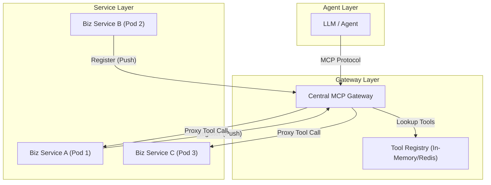

# 設計：遠端註冊式 MCP 架構

本文件描述如何將原本局域化的 Sidecar MCP 設定，重構成為基於「遠端註冊」的中央集權式架構。

## 1. 架構概觀 (Architectural Overview)

在 **遠端註冊 (Remote Registration)** 模型中，MCP Server 扮演 **中央網關 (Central Gateway)** 的角色。它不再與特定的 Microservice 綁定，而是獨立存在，並動態地發現或接收來自各個業務服務的註冊。



## 2. 關鍵組件 (Key Components)

### A. 中央 MCP 網關 (Central MCP Gateway)
- **Dispatcher**: 接收 MCP `list_tools` 和 `call_tool` 請求。
- **Aggregator**: 將所有已註冊服務的 Tool 定義彙整成一份清單提供給 LLM。
- **Proxy**: 透過 HTTP/gRPC 將 Tool 執行請求轉發到正確的遠端服務。

### B. 服務提供者 (Service Provider / Biz Service)
- **Manifest Provider**: 曝露一個端點（例如 `/mcp/manifest` 或 `/v3/api-docs`），描述其具備的能力。
- **Registrar Client**: 一個輕量級函式庫或背景任務，在啟動時呼叫 Gateway 的註冊 API。

## 3. 註冊策略 (Registration Strategies)

### 選項 1：「推」模式 (Push Model - Active Registration)
1. **Biz Service** 啟動。
2. **Biz Service** 發送一個 POST 請求到 `http://mcp-gateway/register`：
   ```json
   {
     "serviceName": "order-service",
     "endpoint": "http://order-service.default.svc.cluster.local:8080",
     "manifestUrl": "/v3/api-docs"
   }
   ```
3. **Gateway** 抓取 Manifest，解析 Tools 並更新 Registry。

### 選項 2：「拉」模式 (Pull Model - Discovery-Based)
1. **Gateway** 定期掃描 Kubernetes Cluster 中帶有特定標籤（例如 `mcp-enabled=true`）的 Services。
2. **Gateway** 自動從發現的服務中抓取 Manifest。
3. **優點**：對業務服務來說是真正的「零侵入 (Zero-touch)」。

## 4. 為什麼要重構成此模型？

| 特性 | Sidecar | 遠端註冊 (Remote Registration) |
| :--- | :--- | :--- |
| **複雜度** | 低 (1 服務 = 1 MCP) | 高 (需要 Registry 管理) |
| **LLM 體驗** | Agent 必須連接多個 Servers | **Agent 只需要連接到一個入口** |
| **擴充性 (Scalability)** | 與 Biz Pod 綁定 | **可獨立擴容 (Independently Scalable)** |
| **可視化 (Visibility)** | 分散且破碎 | **統一管理所有 AI Tools 的儀表板** |

## 5. 實作步驟 (Implementation Steps)

1. **提取 MCP 邏輯**：將 MCP Protocol 處理邏輯從 Sidecar 中抽離，建立獨立的 Spring Boot 專案 (`mcp-gateway`)。
2. **建立註冊表**：在 Gateway 中實作簡單的 `Map<String, ServiceTools>`。
3. **更新業務服務**：在 `biz` 中加入 `springdoc-openapi` 以自動生成 Tool 定義。
4. **實作轉發 (Proxying)**：在 Gateway 中使用 `WebClient` 或 `RestTemplate` 轉發呼叫。
5. **更新 K8s 配置**：為 `biz` 和 `mcp-gateway` 分別建立獨立的 Deployments。
